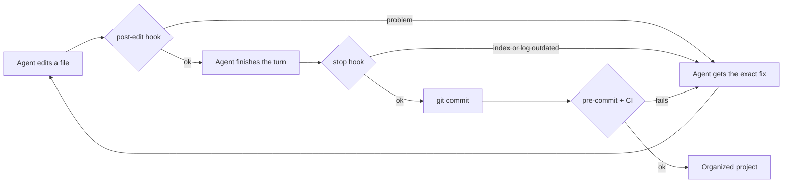

# harness-audit

**Cut what your coding agent loads before you type, and point it straight at what it needs.**

[](LICENSE)
[](https://github.com/fmslutions/harness-audit/actions/workflows/test.yml)


[Português (Brasil)](README.pt-BR.md)

harness-audit is an [Agent Skill](https://agentskills.io) that audits the harness of a software project (CLAUDE.md, AGENTS.md, GEMINI.md, rules, skills, hooks, docs and Obsidian notes), restructures it so agents start every session with a short map, measures the result, and installs guardrails so the project does not drift back into a mess.

It works with **Claude Code, Codex, Cursor and Antigravity CLI** (the successor of Gemini CLI), with or without an **Obsidian** vault.

---

## Contents

- [The problem](#the-problem)
- [What the skill does](#what-the-skill-does)
- [Commands](#commands)
- [Quick start](#quick-start)
- [Installation](#installation)
- [How it keeps the project organized](#how-it-keeps-the-project-organized)
- [What gets installed in your project](#what-gets-installed-in-your-project)
- [Compatibility](#compatibility)
- [Obsidian](#obsidian)
- [Measuring the results](#measuring-the-results)
- [Lint codes](#lint-codes)
- [Limits](#limits)
- [FAQ](#faq)
- [Contributing](#contributing)
- [Sources](#sources)

---

## The problem

Every token an agent loads before your first prompt competes for the model's attention. In real projects that layer grows quietly:

- instruction files turn into encyclopedias;
- the same paragraphs live in CLAUDE.md, AGENTS.md and GEMINI.md;
- `@imports` pull whole documents into every session;
- rules without scope load even when you never touch that code;
- dates and "currently working on" notes break prompt caching;
- notes pile up in Obsidian with no index an agent can use.

The research points in one direction. Model accuracy degrades as context grows (Chroma, *Context Rot*, 18 models tested). Instruction-following drops when files carry too many rules (HumanLayer). Redundant or auto-generated AGENTS.md files can lower task success and raise cost (ETH Zurich evaluation). Fewer, better-placed instructions work better than more instructions.

## What the skill does

1. **Interviews you briefly.** Detects which agents the project uses and whether there is an Obsidian vault, then confirms with you.
2. **Measures a baseline.** Tokens loaded per agent, per layer (always-on, conditional, on demand), plus runtime numbers from Claude Code and Codex transcripts.
3. **Scores the harness** on 8 dimensions and writes a change plan grouped by risk.
4. **Applies only what you approve**, on a separate git branch. It relocates content instead of deleting it.
5. **Installs a maintenance layer**: a placement map, an automatic keeper skill, hooks for each agent, a git pre-commit check and optional CI.
6. **Measures again** and writes a before/after report. Budgets are locked so they can only shrink.

## Commands

| Command | What it does | Changes project files? | When to use |
|---|---|---|---|
| `/harness-audit diagnose` | Detects agents and Obsidian vaults, asks you to confirm, measures the baseline, scores the harness and writes a plan with every proposed change, its risk and the tokens it saves. | No. Writes only to `.harness/reports/`. | First run on any project, or when budgets are breached. |
| `/harness-audit apply` | Creates a git branch, installs the maintenance layer, executes only the plan items you approved, regenerates the index and projections, and runs the lint until it is clean. | Yes, on a new branch, after approval. | Right after reviewing and approving the plan. |
| `/harness-audit verify` | Takes a new snapshot, compares it with the baseline, reruns the task benchmark if you set one, locks the new budgets and writes `HARNESS-REPORT.md`. | Only reports and the budget lock. | After `apply`, in fresh agent sessions. |
| `/harness-audit check` | Runs the fast lint and summarizes problems by severity with suggested fixes. | No. | Weekly, before a release, or anytime. |

Running `/harness-audit` with no argument starts `diagnose`. `apply` refuses to run without an approved plan.

In agents without slash commands, just ask: *"run the harness-audit skill in diagnose mode"*.

### How changes are approved

| Risk | Examples | Approval |
|---|---|---|
| Low | frontmatter, index, broken links, moving files into the right folders | once, as a batch |
| Medium | moving content out of entry files into rules, skills or docs; scoping rules; turning prose rules into hooks | per group |
| High | merging or rewriting knowledge, archiving notes, anything outside the repo (user-level files, external vault) | item by item |

## Quick start

```bash
# 1. Install the skill for Claude Code
git clone https://github.com/fmslutions/harness-audit.git
cp -r harness-audit/skills/harness-audit ~/.claude/skills/

# 2. In your project, with everything committed
claude
> /harness-audit diagnose
```

Review `.harness/reports/plan.md`, approve, then run `/harness-audit apply` and `/harness-audit verify`.

## Installation

Requirements: **Python 3.9+** (standard library only) and **git**.

### Claude Code

```bash
cp -r skills/harness-audit ~/.claude/skills/          # personal, all projects
# or
cp -r skills/harness-audit .claude/skills/            # this project only
```

Keep the `disable-model-invocation: true` line in `SKILL.md`: it hides the skill from the model's context until you call it.

### Claude apps (Settings > Skills upload)

Download `harness-audit.zip` from the [latest release](https://github.com/fmslutions/harness-audit/releases/latest) and upload it. The release zip contains a single `SKILL.md` with standard frontmatter, as the upload requires. Use it where Claude can reach your local project files.

### Codex, Cursor, Antigravity

| Agent | Project folder | Notes |
|---|---|---|
| Codex | `.agents/skills/harness-audit/` | user-level skills folder per Codex docs |
| Cursor | `.cursor/skills/harness-audit/` | or `~/.cursor/skills/` |
| Antigravity CLI | `.agents/skills/harness-audit/` | shares `.agents/skills` with Codex |

### Build the packages yourself

```bash
python3 tools/build_dist.py
```

Creates `dist/harness-audit.zip` and `dist/harness-keeper.zip` (upload-ready, validated) and `dist/claude-code/` (filesystem copies with Claude Code extensions).

## How it keeps the project organized

Writing instructions is not enough, because instructions are probabilistic. The skill combines three layers, following the guides and sensors model described by Birgitta Böckeler on martinfowler.com.



| Layer | Piece | Role |
|---|---|---|
| Guide | `.harness/PLACEMENT.md` | Says where every kind of information goes |
| Guide | `harness-keeper` skill | Loads automatically when the agent touches docs, rules, skills or entry files |
| Sensor | post-edit hook | Checks the file just edited and sends the fix back to the agent |
| Sensor | stop hook | Blocks the end of a turn if the index or log were not updated (loop-guarded) |
| Sensor | pre-commit and CI | Catch anything done outside the agent, by any tool or person |
| Gardener | `/harness-audit check` | Periodic cleanup of stale plans, orphans and budget creep |

One source of truth: `AGENTS.md` is canonical, `CLAUDE.md` imports it with `@AGENTS.md`, and scoped rules and skills live in `.harness/` and are generated into `.claude/`, `.cursor/` and `.agents/` by `sync.py`.

## What gets installed in your project

```
your-project/
├── AGENTS.md                  map + routing table (canonical for all agents)
├── CLAUDE.md                  @AGENTS.md + Claude-specific lines
├── .harness/
│   ├── config.json            agents, docs root, budgets, placement folders
│   ├── PLACEMENT.md           where each thing goes
│   ├── rules/                 canonical scoped rules
│   ├── skills/harness-keeper/ canonical keeper skill
│   ├── scripts/               lint, sync, index, hooks, measurement (vendored)
│   ├── reports/               baseline, plan, after, HARNESS-REPORT.md
│   └── budgets.lock.json      ratchet
├── docs/                      (or your Obsidian folder)
│   ├── index.md               generated catalog
│   ├── log.md                 append-only history
│   └── decisions/ plans/ runbooks/ references/ architecture/ product/ raw/
├── .claude/settings.json      hooks            .claude/rules, .claude/skills   (generated)
├── .cursor/hooks.json         hooks            .cursor/rules, .cursor/skills   (generated)
├── .codex/hooks.json          hooks            .agents/skills                  (generated)
└── .agents/hooks.harness.example.json          Antigravity hooks, to adapt
```

Scripts are copied into the project, so teammates and CI do not need the skill installed.

## Compatibility

| | Claude Code | Codex | Cursor | Antigravity CLI |
|---|---|---|---|---|
| Inventory of loaded context | Full | Full | Full (User Rules are manual) | Full |
| Runtime measurement | Transcripts | Transcripts | Manual (UI) | Manual (`agy inspect`) |
| Scoped rules | `.claude/rules` with `paths` | Routing table | `.cursor/rules/*.mdc` with `globs` | Routing table |
| Skills | `.claude/skills` | `.agents/skills` | `.cursor/skills` | `.agents/skills` |
| Post-edit hook | Blocks and feeds back | Blocks and feeds back | Records, reports on stop | Experimental |
| Stop hook | Yes | Yes | `followup_message` | Experimental |
| Pre-commit and CI | Yes | Yes | Yes | Yes |

Gemini CLI stopped serving individual accounts in June 2026; projects still using it are handled by the Antigravity adapter.

**Models.** The skill depends on the agent, not on a specific model. Use a frontier model for `diagnose` and `apply` (long, multi-step work with many file edits). `check` is script-driven and runs fine on smaller models. The heavy lifting is done by deterministic Python scripts, so results are consistent across agents.

## Obsidian

During `diagnose` the skill scans the repo, parent folders and common locations (Documents, iCloud, Dropbox, OneDrive) for `.obsidian` folders and asks you to confirm the vault and the project folder. Three layouts are supported:

| Layout | Example | Agent access |
|---|---|---|
| Vault inside the repo | `repo/docs/` is a vault | native |
| Repo inside the vault | `Vault/Projects/app/` is the repo | native |
| External vault | `~/Vault/Projects/App/` | Claude Code gets the folder in `additionalDirectories`; Codex needs `--add-dir`; Cursor needs a multi-root workspace |

Notes get frontmatter that Obsidian Properties and Dataview also read. The index is generated from that frontmatter. Markdown links with relative paths are preferred over bare `[[wikilinks]]`, which agents cannot resolve reliably. Details in [`references/obsidian.md`](skills/harness-audit/references/obsidian.md).

## Measuring the results

Want to know if it works on your project before starring? Run the full cycle and read the numbers.

```bash
/harness-audit diagnose      # baseline saved to .harness/reports/baseline.json
/harness-audit apply
/harness-audit verify        # after.json + comparison table
```

### First pilot: a real project

Measured on `fabianmartinelli.com`, a Next.js 16 site with Supabase, MDX content and three locales, used daily with Claude Code and Codex. Same model (Opus 5) and same effort level in both rounds.

**Context loaded before the first prompt**, read from `/context` in a fresh session:

| Stage | Session start | What changed |
|---|---|---|
| Baseline | 70.0 k | — |
| After user-level cleanup | 60.0 k | unused framework archived (66 skills, 33 agents, 10 hooks), one plugin disabled for this project |
| After `apply` | 64.5 k | map, routing table and keeper skill added on purpose |

Static inventory, which the scripts read without a running session: Claude Code 9,288 → 7,815 tokens, Codex 4,729 → 3,257 tokens. Those numbers apply to every project on that machine, not only this one.

**Four real tasks, run twice**, in fresh sessions, before and after:

| Task | Context spent before | After | Time before | After |
|---|---|---|---|---|
| Explain the i18n flow | 95 k | 92 k | 4 min | 1 min |
| Propose a decision record | 120 k | 90 k | 15 min | 2 min |
| Find and fix a planted bug | 86 k | 91 k | 9 min | 1 min |
| Add a new section to the home page | 144 k | 137 k | 12 min | 3 min |
| **Total** | **445 k** | **410 k** | **40 min** | **7 min** |

**Read this honestly.** Task success was 8/8 in both rounds: the agent already solved everything before the audit, so the skill did not make it smarter, and it never will. What changed is how it got there:

- **time dropped about fivefold**, because the agent went straight to the right file instead of exploring;
- **operator interventions went from 2 to 0**;
- **side effects went from 6 to 0**. In the first round the agent wrote five files into an external Obsidian vault, committed in the middle of a task and left a dev server running. In the second round it asked first and wrote nothing;
- **decisions got grounded**. Asked for a new section, the agent read the design rules first and refused to use a card because a recorded decision forbids cards on that site. It also refused to invent testimonials, and said so.

Context spent per task fell only 8%. If your projects are mostly read-heavy work like this one, expect the win in time, consistency and blast radius rather than in tokens.

### Second pilot: a repository that had gone unmaintained

Same skill, a very different starting point: a large Next.js product repo (site, admin, client portal, several products) with ~2,800 tests, a git submodule, 25 worktrees and several sessions landing PRs in parallel. Two agents, Claude Code and Codex.

| | Before | After |
|---|---|---|
| Session start (`/context`, 1M window) | **555.8 k (56% of the window)** | **73.6 k (7%)** |
| Memory files | 495.8 k | 13.7 k |
| `CLAUDE.md` | 13,071 lines | 56 lines |
| `AGENTS.md` | 3,362 lines, **truncated** | 113 lines, read in full |
| Lint errors | 185 | 0 |

The finding that paid for the audit was not the token count. **Codex was reading about 10% of `AGENTS.md`**: the file was 349 KB against a 32 KB cap, and the truncation is silent, with no error and nothing in any log. Months of instructions written for an agent that never received them. On top of that, 93.9% of `AGENTS.md` was a literal copy of `CLAUDE.md`, so the project had two sources of truth maintained by hand and one of them was read half-way.

125 rules moved into `docs/rules/` with frontmatter. Nothing was deleted: superseded content kept `status: superseded`, and 10 sections that existed in both entry files with different content were moved out and marked `draft` for a human to reconcile, not merged silently. After the audit: typecheck clean, 2,777 tests passing, production build green.

**The two pilots together are the honest range.** On a tidy project the context win is small and the payoff is speed and blast radius. On a project that had grown unchecked for months the context win is most of the window. Run `diagnose` and read your own numbers before deciding what this is worth to you.

For a stronger test, agree on 3 to 5 real tasks during `diagnose`. `verify` reruns them in fresh sessions and compares success, turns and peak context. A smaller context with worse task results counts as a regression.

Please share your numbers in a [results issue](https://github.com/fmslutions/harness-audit/issues/new?template=results.md). Real reports calibrate the default budgets for everyone.

## Lint codes

| Code | Severity | Meaning |
|---|---|---|
| H001 | error | Entry file over the line budget |
| H002 | error | Always-on context over the token budget |
| H003 | warn | `@import` of docs in CLAUDE.md (loads every session) |
| H004 | warn | Claude rule without `paths` |
| H005 | error/warn | Cursor rule problem (`.md` ignored, large `alwaysApply`, legacy `.cursorrules`) |
| H006 | error | Codex AGENTS.md chain over `project_doc_max_bytes` (silent truncation) |
| H007 | error | Doc missing required frontmatter or invalid status |
| H008 | error | Index out of date |
| H009 | warn | Broken relative link |
| H010 | warn | Doc outside the placement map |
| H011 | warn | Same paragraph repeated across entry files |
| H012 | error | Generated file out of sync or edited by hand |
| H013 | warn | Dates, status or current work in an always-on file |
| H014 | warn/info | Completed plan still active, or stale doc |
| H015 | error | Always-on context grew past the locked budget |
| H016 | warn | Skill description too long |
| H017 | info | Wikilink that does not resolve to a file |
| H018 | error | Docs changed without a log entry (stop hook) |

Run it anytime: `python3 .harness/scripts/lint.py` (`--json`, `--staged`, `--strict`, `--update-lock`).

## Limits

- Token counts from files are estimates (about 4 characters per token). Runtime numbers come from Claude Code and Codex transcripts; Cursor and Antigravity numbers are typed in by you.
- Antigravity hook names and schema change between `agy` versions. An example file is installed for you to adapt; until then, pre-commit and CI are the guaranteed checks.
- Cursor User Rules live in the app settings and cannot be read from disk.
- Hooks for notes in an external vault run locally; git and CI cannot see those files.
- Vendors change loading rules often. Each agent reference records when it was checked.

## FAQ

**Will it delete my docs?**
No. Superseded content gets `status: superseded`. `apply` works on a branch that you review before merging.

**Does it touch `~/.claude`, `~/.codex` or `~/.gemini`?**
Only measures them if you allow it. Changes there need explicit approval per file.

**Do I need Obsidian?**
No. Without a vault, knowledge lives in `docs/`.

**Can I use it on a brand new project?**
Yes. `apply` sets up the structure and guardrails from the start.

**Why is `harness-keeper` a separate skill?**
It is small and loads automatically during normal work. The audit is heavy and runs only when you call it. `apply` installs the keeper into each project for every agent.

## Contributing

Bug reports, agent adapters and real-world results are welcome. See [CONTRIBUTING.md](CONTRIBUTING.md). Run `bash tests/smoke.sh` before opening a pull request.

If the skill saved you context or a cleanup afternoon, a star helps other people find it.

## Sources

- Anthropic: *Effective context engineering for AI agents*; Claude Code docs (memory, skills, hooks)
- OpenAI: *Harness engineering: leveraging Codex in an agent-first world*
- Andrej Karpathy: *llm-wiki* (April 2026)
- Chroma: *Context Rot: How Increasing Input Tokens Impacts LLM Performance*
- HumanLayer: *Writing a good CLAUDE.md*; Dex Horthy on research, plan, implement
- Philipp Schmid: *Writing a Good AGENTS.md* (ETH Zurich evaluation)
- Manus: *Context Engineering for AI Agents: Lessons from Building Manus*
- Birgitta Böckeler: *Harness engineering for coding agent users* (martinfowler.com)

## License

[MIT](LICENSE). Built by [Fabian Martinelli](https://fabianmartinelli.com) at FM Solutions.
