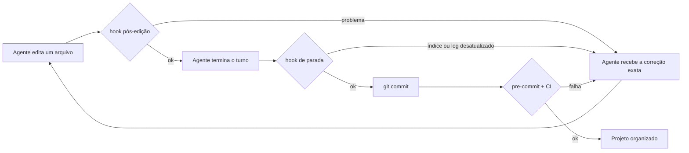

# harness-audit

**Corte o que seu agente de código carrega antes de você digitar, e aponte ele direto para o que importa.**

[](LICENSE)
[](https://github.com/fmslutions/harness-audit/actions/workflows/test.yml)


[English](README.md)

harness-audit é uma [Agent Skill](https://agentskills.io) que audita o harness de um projeto de software (CLAUDE.md, AGENTS.md, GEMINI.md, regras, skills, hooks, documentação e notas do Obsidian), reorganiza tudo para que o agente comece cada sessão com um mapa curto, mede o resultado e instala proteções para o projeto não voltar a ficar bagunçado.

Funciona com **Claude Code, Codex, Cursor e Antigravity CLI** (sucessor do Gemini CLI), com ou sem um vault do **Obsidian**.

---

## Sumário

- [O problema](#o-problema)
- [O que a skill faz](#o-que-a-skill-faz)
- [Comandos](#comandos)
- [Início rápido](#início-rápido)
- [Instalação](#instalação)
- [Como o projeto continua organizado](#como-o-projeto-continua-organizado)
- [O que é instalado no seu projeto](#o-que-é-instalado-no-seu-projeto)
- [Compatibilidade](#compatibilidade)
- [Obsidian](#obsidian)
- [Medindo os resultados](#medindo-os-resultados)
- [Códigos do lint](#códigos-do-lint)
- [Limitações](#limitações)
- [Perguntas frequentes](#perguntas-frequentes)
- [Como contribuir](#como-contribuir)
- [Fontes](#fontes)

---

## O problema

Cada token que o agente carrega antes do seu primeiro prompt disputa a atenção do modelo. Em projetos reais, essa camada cresce sem ninguém perceber:

- arquivos de instrução viram enciclopédias;
- os mesmos parágrafos aparecem no CLAUDE.md, no AGENTS.md e no GEMINI.md;
- `@imports` puxam documentos inteiros para todas as sessões;
- regras sem escopo carregam mesmo quando você nem mexe naquele código;
- datas e anotações de "estou trabalhando em" quebram o cache do prompt;
- as notas se acumulam no Obsidian sem um índice que o agente consiga usar.

As pesquisas apontam na mesma direção. A precisão dos modelos cai conforme o contexto cresce (Chroma, *Context Rot*, 18 modelos testados). A obediência às instruções piora quando os arquivos têm regras demais (HumanLayer). Arquivos AGENTS.md redundantes ou gerados automaticamente podem reduzir a taxa de sucesso e aumentar o custo (avaliação da ETH Zurich). Menos instruções, bem colocadas, funcionam melhor do que mais instruções.

## O que a skill faz

1. **Faz uma entrevista curta.** Detecta quais agentes o projeto usa e se existe um vault do Obsidian, e confirma com você.
2. **Mede a linha de base.** Tokens carregados por agente e por camada (sempre carregada, condicional, sob demanda), mais números reais dos transcripts do Claude Code e do Codex.
3. **Dá nota ao harness** em 8 dimensões e escreve um plano de mudanças agrupado por risco.
4. **Aplica só o que você aprova**, numa branch separada do git. Ela realoca conteúdo em vez de apagar.
5. **Instala uma camada de manutenção**: mapa de lugares, uma skill guardiã automática, hooks para cada agente, checagem no pre-commit e CI opcional.
6. **Mede de novo** e gera um relatório de antes e depois. Os orçamentos ficam travados e só podem diminuir.

## Comandos

| Comando | O que faz | Altera arquivos do projeto? | Quando usar |
|---|---|---|---|
| `/harness-audit diagnose` | Detecta agentes e vaults do Obsidian, pede sua confirmação, mede a linha de base, dá nota ao harness e escreve um plano com cada mudança proposta, o risco e os tokens economizados. | Não. Escreve só em `.harness/reports/`. | Na primeira vez em qualquer projeto, ou quando um orçamento estourar. |
| `/harness-audit apply` | Cria uma branch no git, instala a camada de manutenção, executa apenas os itens aprovados, regenera o índice e as cópias por agente, e roda o lint até ficar limpo. | Sim, numa branch nova, depois da aprovação. | Logo após revisar e aprovar o plano. |
| `/harness-audit verify` | Tira uma nova medição, compara com a linha de base, entrega os prompts do benchmark de tarefas para você rodar em sessão nova, trava os novos orçamentos e escreve o `HARNESS-REPORT.md`. | Só relatórios e a trava de orçamento. | Depois do `apply`, em sessões novas dos agentes. |
| `/harness-audit check` | Roda o lint rápido e resume os problemas por gravidade, com correções sugeridas. | Não. | Toda semana, antes de um release, ou quando quiser. |

Rodar `/harness-audit` sem argumento inicia o `diagnose`. O `apply` se recusa a rodar sem um plano aprovado.

Em agentes sem comandos de barra, basta pedir: *"rode a skill harness-audit no modo diagnose"*.

### Como as mudanças são aprovadas

| Risco | Exemplos | Aprovação |
|---|---|---|
| Baixo | frontmatter, índice, links quebrados, mover arquivos para as pastas certas | uma vez, em bloco |
| Médio | tirar conteúdo dos arquivos de entrada e levar para regras, skills ou docs; dar escopo a regras; transformar regras em texto em hooks | por grupo |
| Alto | fundir ou reescrever conhecimento, arquivar notas, qualquer coisa fora do repositório (arquivos do usuário, vault externo) | item por item |

## Início rápido

```bash
# 1. Instale a skill no Claude Code
git clone https://github.com/fmslutions/harness-audit.git
cp -r harness-audit/skills/harness-audit ~/.claude/skills/

# 2. No seu projeto, com tudo commitado
claude
> /harness-audit diagnose
```

Revise `.harness/reports/plan.md`, aprove, depois rode `/harness-audit apply` e `/harness-audit verify`.

## Instalação

Requisitos: **Python 3.9+** (só biblioteca padrão) e **git**.

### Claude Code

```bash
cp -r skills/harness-audit ~/.claude/skills/          # pessoal, todos os projetos
# ou
cp -r skills/harness-audit .claude/skills/            # só este projeto
```

Mantenha a linha `disable-model-invocation: true` no `SKILL.md`: ela esconde a skill do contexto do modelo até você chamá-la.

### Apps do Claude (upload em Configurações > Habilidades)

Baixe o `harness-audit.zip` do [último release](https://github.com/fmslutions/harness-audit/releases/latest) e faça o upload. O zip do release tem um único `SKILL.md` com frontmatter padrão, como o upload exige. Use onde o Claude tem acesso aos arquivos locais do projeto.

### Codex, Cursor, Antigravity

| Agente | Pasta no projeto | Observação |
|---|---|---|
| Codex | `.agents/skills/harness-audit/` | pasta de skills do usuário conforme a documentação do Codex |
| Cursor | `.cursor/skills/harness-audit/` | ou `~/.cursor/skills/` |
| Antigravity CLI | `.agents/skills/harness-audit/` | compartilha `.agents/skills` com o Codex |

### Gerar os pacotes você mesmo

```bash
python3 tools/build_dist.py
```

Cria `dist/harness-audit.zip` e `dist/harness-keeper.zip` (prontos para upload, validados) e `dist/claude-code/` (cópias para instalar direto no Claude Code).

## Como o projeto continua organizado

Escrever instruções não basta, porque instrução é probabilística. A skill combina três camadas, seguindo o modelo de guias e sensores descrito por Birgitta Böckeler no martinfowler.com.



| Camada | Peça | Papel |
|---|---|---|
| Guia | `.harness/PLACEMENT.md` | Diz onde cada tipo de informação deve ficar |
| Guia | skill `harness-keeper` | Carrega sozinha quando o agente mexe em docs, regras, skills ou arquivos de entrada |
| Sensor | hook pós-edição | Confere o arquivo recém-editado e devolve a correção ao agente |
| Sensor | hook de parada | Impede o fim do turno se o índice ou o log não foram atualizados (com proteção contra loop) |
| Sensor | pre-commit e CI | Pegam o que foi feito fora do agente, por qualquer ferramenta ou pessoa |
| Jardineiro | `/harness-audit check` | Limpeza periódica de planos parados, notas órfãs e orçamento crescendo |

Uma única fonte de verdade: o `AGENTS.md` é o canônico, o `CLAUDE.md` importa ele com `@AGENTS.md`, e as regras com escopo e as skills ficam em `.harness/` e são geradas em `.claude/`, `.cursor/` e `.agents/` pelo `sync.py`.

## O que é instalado no seu projeto

```
seu-projeto/
├── AGENTS.md                  mapa + tabela de roteamento (canônico para todos os agentes)
├── CLAUDE.md                  @AGENTS.md + linhas específicas do Claude
├── .harness/
│   ├── config.json            agentes, pasta de docs, orçamentos, pastas do mapa
│   ├── PLACEMENT.md           onde cada coisa vai
│   ├── rules/                 regras canônicas com escopo
│   ├── skills/harness-keeper/ skill guardiã canônica
│   ├── scripts/               lint, sync, índice, hooks, medição, sensor de código, leitura da árvore (copiados para o projeto)
│   ├── reports/               baseline, plano, after, HARNESS-REPORT.md
│   └── budgets.lock.json      trava de orçamento
├── docs/                      (ou sua pasta do Obsidian)
│   ├── index.md               catálogo gerado
│   ├── log.md                 histórico, só acréscimo
│   └── decisions/ plans/ runbooks/ references/ architecture/ product/ raw/
├── .claude/settings.json      hooks            .claude/rules, .claude/skills   (gerados)
├── .cursor/hooks.json         hooks            .cursor/rules, .cursor/skills   (gerados)
├── .codex/hooks.json          hooks            .agents/skills                  (gerados)
└── .agents/hooks.harness.example.json          hooks do Antigravity, para adaptar
```

Os scripts ficam dentro do projeto, então a equipe e o CI não precisam da skill instalada.

## Compatibilidade

| | Claude Code | Codex | Cursor | Antigravity CLI |
|---|---|---|---|---|
| Inventário do contexto carregado | Completo | Completo | Completo (User Rules são manuais) | Completo |
| Medição em execução | Transcripts | Transcripts | Manual (interface) | Manual (`agy inspect`) |
| Regras com escopo | `.claude/rules` com `paths` | Tabela de roteamento | `.cursor/rules/*.mdc` com `globs` | Tabela de roteamento |
| Skills | `.claude/skills` | `.agents/skills` | `.cursor/skills` | `.agents/skills` |
| Hook pós-edição | Bloqueia e devolve a correção | Bloqueia e devolve a correção | Registra e avisa no fim | Experimental |
| Hook de parada | Sim | Sim | `followup_message` | Experimental |
| Pre-commit e CI | Sim | Sim | Sim | Sim |

O Gemini CLI parou de atender contas individuais em junho de 2026; projetos que ainda o usam são tratados pelo adaptador do Antigravity.

**Modelos.** A skill depende do agente, não de um modelo específico. Use um modelo de fronteira no `diagnose` e no `apply` (trabalho longo, com várias etapas e muitas edições). O `check` é baseado em scripts e roda bem em modelos menores. O trabalho pesado fica em scripts Python determinísticos, então o resultado é consistente entre agentes.

## Obsidian

No `diagnose`, a skill procura pastas `.obsidian` no repositório, nas pastas acima e em locais comuns (Documents, iCloud, Dropbox, OneDrive) e pede para você confirmar o vault e a pasta do projeto. Três arranjos são suportados:

| Arranjo | Exemplo | Acesso do agente |
|---|---|---|
| Vault dentro do repositório | `repo/docs/` é um vault | nativo |
| Repositório dentro do vault | `Vault/Projetos/app/` é o repositório | nativo |
| Vault externo | `~/Vault/Projetos/App/` | no Claude Code a pasta entra em `additionalDirectories`; o Codex precisa de `--add-dir`; o Cursor precisa de workspace com várias raízes |

As notas recebem frontmatter que o Properties e o Dataview do Obsidian também leem. O índice é gerado a partir desse frontmatter. Links markdown com caminho relativo são preferidos aos `[[wikilinks]]`, que os agentes não conseguem resolver com segurança. Detalhes em [`references/obsidian.md`](skills/harness-audit/references/obsidian.md).

## Medindo os resultados

Quer saber se funciona no seu projeto antes de dar uma estrela? Rode o ciclo completo e veja os números.

```bash
/harness-audit diagnose      # linha de base salva em .harness/reports/baseline.json
/harness-audit apply
/harness-audit verify        # after.json + tabela comparativa
```

### Primeiro piloto: um projeto real

Medido no `fabianmartinelli.com`, um site em Next.js 16 com Supabase, conteúdo em MDX e três idiomas, usado todo dia com Claude Code e Codex. Mesmo modelo (Opus 5) e mesmo esforço nas duas rodadas.

**Contexto carregado antes da primeira instrução**, lido no `/context` em sessão nova:

| Etapa | Partida da sessão | O que mudou |
|---|---|---|
| Linha de base | 70,0 k | — |
| Após a limpeza de nível de usuário | 60,0 k | framework sem uso arquivado (66 skills, 33 agentes, 10 hooks), um plugin desligado neste projeto |
| Após o `apply` | 64,5 k | mapa, tabela de roteamento e skill guardiã, adicionados de propósito |

Inventário estático, que os scripts leem sem sessão aberta: Claude Code de 9.288 para 7.815 tokens, Codex de 4.729 para 3.257. Esses números valem para todos os projetos daquela máquina, não só para este.

**Quatro tarefas reais, rodadas duas vezes**, em sessões novas, antes e depois:

| Tarefa | Contexto gasto antes | Depois | Tempo antes | Depois |
|---|---|---|---|---|
| Explicar o fluxo de idioma | 95 k | 92 k | 4 min | 1 min |
| Propor um registro de decisão | 120 k | 90 k | 15 min | 2 min |
| Achar e corrigir um bug plantado | 86 k | 91 k | 9 min | 1 min |
| Adicionar uma seção à página inicial | 144 k | 137 k | 12 min | 3 min |
| **Total** | **445 k** | **410 k** | **40 min** | **7 min** |

**Leia isto com honestidade.** O acerto foi 8/8 nas duas rodadas: o agente já resolvia tudo antes da auditoria, então a skill não o deixou mais inteligente, e nunca vai deixar. O que mudou foi o caminho até o resultado:

- **o tempo caiu cerca de cinco vezes**, porque o agente foi direto ao arquivo certo em vez de explorar;
- **as intervenções do operador foram de 2 para 0**;
- **os efeitos colaterais foram de 6 para 0**. Na primeira rodada o agente gravou cinco arquivos num vault do Obsidian fora do repositório, fez commit no meio de uma tarefa e deixou um servidor rodando. Na segunda, perguntou antes e não gravou nada;
- **as decisões passaram a ter fundamento**. Ao criar uma seção nova, o agente leu as regras visuais primeiro e recusou usar card, porque uma decisão registrada proíbe card naquele site. Também se recusou a inventar depoimentos, e avisou.

O contexto gasto por tarefa caiu só 8%. Se os seus projetos forem de leitura pesada como este, espere o ganho em tempo, consistência e estrago evitado, não em tokens.

### Segundo piloto: um repositório que ficou sem manutenção

Mesma skill, um ponto de partida bem diferente: um repositório grande de produto em Next.js (site, admin, portal do cliente, vários produtos) com cerca de 2.800 testes, um submódulo git, 25 worktrees e várias sessões entregando PRs em paralelo. Dois agentes, Claude Code e Codex.

| | Antes | Depois |
|---|---|---|
| Partida da sessão (`/context`, janela de 1M) | **555,8 k (56% da janela)** | **73,6 k (7%)** |
| Memory files | 495,8 k | 13,7 k |
| `CLAUDE.md` | 13.071 linhas | 56 linhas |
| `AGENTS.md` | 3.350 linhas, **truncado** | 113 linhas, lido inteiro |
| Erros de lint | 185 | 0 |

O achado que pagou a auditoria não foi a contagem de tokens. **O Codex lia cerca de 10% do `AGENTS.md`**: o arquivo tinha 349 KB contra um teto de 32 KB, e o corte é silencioso, sem erro e sem nada em log nenhum. Meses de instruções escritas para um agente que nunca as recebeu. Além disso, 92,5% do `AGENTS.md` era cópia literal do `CLAUDE.md` (3.031 das suas 3.276 linhas não vazias), ou seja, o projeto tinha duas verdades mantidas à mão e uma delas era lida pela metade.

125 regras foram para `docs/rules/` com frontmatter. Nada foi apagado: o conteúdo superado ficou com `status: superseded`, e 10 seções que existiam nos dois arquivos de entrada com conteúdo diferente saíram marcadas como `draft` para um humano reconciliar, em vez de serem mescladas em silêncio. Depois da auditoria: verificação de tipos limpa, 2.777 testes passando e build de produção verde.

**Os dois pilotos juntos são a faixa honesta.** Num projeto organizado o ganho de contexto é pequeno e o retorno vem em velocidade e estrago evitado. Num projeto que cresceu sem controle por meses, o ganho de contexto é quase toda a janela. Rode o `diagnose` e leia seus próprios números antes de decidir o que isso vale para você.

Para um teste mais forte, combine de 3 a 5 tarefas reais durante o `diagnose`. O `verify` mede sozinho o que consegue medir sozinho — contexto, lint, tamanho dos arquivos de entrada e cobertura de leitura do Codex — e, para a parte comportamental, apresenta os prompts e pede que você rode em sessão nova, porque subagente herda o contexto da sessão que o chamou e mediria o harness errado. Contexto menor com resultado pior nas tarefas conta como regressão.

Compartilhe seus números numa [issue de resultados](https://github.com/fmslutions/harness-audit/issues/new?template=results.md). Relatos reais ajudam a calibrar os orçamentos padrão para todo mundo.

## Códigos do lint

| Código | Gravidade | Significado |
|---|---|---|
| H001 | erro | Arquivo de entrada acima do limite de linhas |
| H002 | erro | Contexto sempre carregado acima do orçamento de tokens |
| H003 | aviso | `@import` de docs no CLAUDE.md (carrega em toda sessão) |
| H004 | aviso | Regra do Claude sem `paths` |
| H005 | erro/aviso | Problema em regra do Cursor (`.md` ignorado, `alwaysApply` grande, `.cursorrules` legado) |
| H006 | erro | Cadeia de AGENTS.md do Codex acima de `project_doc_max_bytes` (corte silencioso) |
| H007 | erro | Doc sem o frontmatter obrigatório ou com status inválido |
| H008 | erro | Índice desatualizado |
| H009 | aviso | Link relativo quebrado |
| H010 | aviso | Doc fora das pastas do mapa |
| H011 | aviso | Mesmo parágrafo repetido em arquivos de entrada |
| H012 | erro | Arquivo gerado fora de sincronia ou editado à mão |
| H013 | aviso | Datas, status ou trabalho em andamento num arquivo sempre carregado |
| H014 | aviso/info | Plano concluído ainda em active, ou doc desatualizado |
| H015 | erro | Contexto sempre carregado cresceu além do orçamento travado |
| H016 | aviso | Descrição de skill longa demais |
| H017 | info | Wikilink que não aponta para nenhum arquivo |
| H018 | erro | Docs alterados sem registro no log (hook de parada) |
| H019 | aviso | Orçamentos ainda são os transitórios medidos na instalação |
| H020 | aviso | `CLAUDE.local.md` desliga o `AGENTS.md` do time só para uma pessoa |
| H021 | erro | `CLAUDE.md` acima de 4 MiB: o Claude Code ignora o arquivo inteiro |
| H022 | aviso | `AGENTS.override.md`: o Codex lê, o Claude Code nunca |

Rode quando quiser: `python3 .harness/scripts/lint.py` (`--json`, `--staged`, `--strict`, `--update-lock`).

## Limitações

- A contagem de tokens a partir dos arquivos é uma estimativa (cerca de 4 caracteres por token). Os números reais vêm dos transcripts do Claude Code e do Codex; os do Cursor e do Antigravity você informa manualmente.
- Os nomes e o formato dos hooks do Antigravity mudam entre versões do `agy`. Um arquivo de exemplo é instalado para você adaptar; até lá, pre-commit e CI são as checagens garantidas.
- As User Rules do Cursor ficam nas configurações do app e não podem ser lidas do disco.
- Hooks para notas num vault externo rodam localmente; o git e o CI não enxergam esses arquivos.
- Os fornecedores mudam as regras de carregamento com frequência. Cada referência de agente registra quando foi verificada.

## Perguntas frequentes

**Ela vai apagar minha documentação?**
Não. Conteúdo substituído recebe `status: superseded`. O `apply` trabalha numa branch que você revisa antes do merge.

**Ela mexe em `~/.claude`, `~/.codex` ou `~/.gemini`?**
Só mede, e só se você permitir. Qualquer mudança nesses arquivos exige aprovação explícita, arquivo por arquivo.

**Preciso usar Obsidian?**
Não. Sem vault, o conhecimento fica em `docs/`.

**Posso usar num projeto novo?**
Sim. O `apply` monta a estrutura e as proteções desde o começo.

**Por que a `harness-keeper` é uma skill separada?**
Ela é pequena e carrega sozinha durante o trabalho normal. A auditoria é pesada e só roda quando você chama. O `apply` instala a guardiã em cada projeto, para todos os agentes.

## Como contribuir

Relatos de bug, adaptadores para novos agentes e resultados de uso real são bem-vindos. Veja o [CONTRIBUTING.md](CONTRIBUTING.md). Rode `bash tests/smoke.sh` antes de abrir um pull request.

Se a skill economizou contexto ou uma tarde de faxina no seu projeto, uma estrela ajuda outras pessoas a encontrá-la.

## Fontes

- Anthropic: *Effective context engineering for AI agents*; documentação do Claude Code (memory, skills, hooks)
- OpenAI: *Harness engineering: leveraging Codex in an agent-first world*
- Andrej Karpathy: *llm-wiki* (abril de 2026)
- Chroma: *Context Rot: How Increasing Input Tokens Impacts LLM Performance*
- HumanLayer: *Writing a good CLAUDE.md*; Dex Horthy sobre research, plan, implement
- Philipp Schmid: *Writing a Good AGENTS.md* (avaliação da ETH Zurich)
- Manus: *Context Engineering for AI Agents: Lessons from Building Manus*
- Birgitta Böckeler: *Harness engineering for coding agent users* (martinfowler.com)

## Licença

[MIT](LICENSE). Criado por [Fabian Martinelli](https://fabianmartinelli.com) na FM Solutions.
